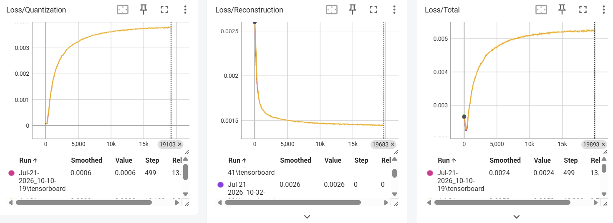
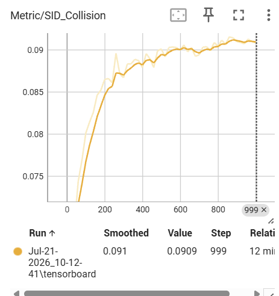

#  News Recommendation System

基于 MIND 新闻数据集搭建端到端生成式新闻推荐系统，完成用户行为解析、新闻文本向量化、用户级数据划分及 Hit@K、NDCG@K 评估；分别采用 RQ-VAE 与 RQ-KMeans 将新闻向量离散化为多级 Semantic ID，使用Sinkhorn算法缓解码本冲突，对比不同量化方法的 SID 碰撞率、编码效率和召回效果；基于 T5 Encoder-Decoder 与 Qwen2 Causal LM 实现生成式召回，形成“T5/Qwen × RQ-VAE/RQ-KMeans”对比实验矩阵；基于曝光日志构造265万组 click/unclick 偏好样本并实现 DPO 优化，在原始召回模型的基础上，Hit@10、Hit@20、NDCG@20 均有所提升。

部分代码参考 [TIGER](https://github.com/XiaoLongtaoo/TIGER) ，[RQ-KMEANS](https://github.com/EdoardoBotta/rq-kmeans)

## 数据集

本项目基于**MIND** 数据集搭建，MIND 是微软亚洲研究院基于 Microsoft News 平台匿名用户行为日志构建的新闻推荐数据集，包含新闻内容、用户历史点击行为以及曝光日志。本文使用的是 `MIND larger` 版本，包含2M条交互数据，70W用户，10W条新闻

### news.csv 示例

| 列名        | 示例                                                         |
| ----------- | ------------------------------------------------------------ |
| news_id     | N1                                                           |
| category    | sports                                                       |
| subcategory | football_nfl                                                 |
| title       | Texans defensive tackle D.J. Reader is taking advantage of his opportunities |
| abstract    | Houston Texans defensive tackle D.J. Reader is taking advantage of opportunities given by defensive end J.J. Watt |

### behaviors.csv 示例

| 列名        | 示例                                        |
| ----------- | ------------------------------------------- |
| id          | 1                                           |
| user_id     | U87243                                      |
| time        | 2019-11-10 11:30:54                         |
| history     | `['N8668', 'N39081', ..., 'N64932']`        |
| impressions | `['N78206-0', 'N26368-1', ..., 'N27822-0']` |


## 环境要求

在 ubnutu 25.10 python=3.10下可以正常运行 

```bash
pip install -r requirements.txt.txt
```

## 数据准备

### 1. 下载 MIND 数据集

从 [MIND 官网](https://msnews.github.io/) 下载 zip 格式数据集：`MINDsmall_train.zip`或其他版本的文件（需修改config中对应的属性）

将数据集放入 `tmp` 目录下：

```text
tmp/
├── MINDsmall_train.zip
```

### 2. 下载文本编码模型

下载 [all-MiniLM-L6-v2](https://modelscope.cn/models/sentence-transformers/all-MiniLM-L6-v2) 到 `tmp` 目录下：

```bash
modelscope download \
  --model sentence-transformers/all-MiniLM-L6-v2 \
  --local_dir tmp/all-MiniLM-L6-v2
```


## 使用方法

### 1. 数据预处理与新闻 embedding 生成

运行 preprocess,py：

```text
python preprocess.py
```

- 解析处理 MIND 原始数据；
- 划分训练集、验证集；
- 使用 `all-MiniLM-L6-v2` 根据新闻标题生成新闻 embedding。

### 2. 生成 Semantic ID

新闻 embedding 离散化为 Semantic ID，根据根据`config/generate_sid` 中sid_method字段执行RQ-VAE或RQ-KMEANS

```bash
python rec/semantic/generate_code.py
```


执行以下指令可以观察RQ-VAE训练过程中的结果

```python
tensorboard --logdir .\ckpt
```


### 3. 训练模型

训练并验证T5模型：

```bash
python rec/transformer/GR_T5.py
```


训练并验证Qwen模型：

```python
python rec/transformer/GR_Qwen.py
```

该阶段根据用户历史点击序列训练生成式召回模型，并在验证集上评估召回效果。


### 4. 强化学习

用训练好的权重做强化学习DPO，强化学习的目标是click>unclick

```python
python rec/transformer/DPO_Qwen.py \
  --checkpoint runs/权重/best_model.pth
```


## 训练耗时

SID构建

+ RQ-VAE 耗时`12mins`
+ RQ-KMEANS  设置早停（聚类中心的移动量小于阈值）后比RQ-VAE快，大约`3~5mins`

模型训练和验证

- T5模型在给定的参数(7M)下，train的一个epoch耗时`10mins`，evaluate的一个epoch耗时`25mins`，通过调整参数可以在12GB显存下运行；

- Qwen模型在给定的参数(4M)下，train的一个epoch耗时`10mins`，evaluate的一个epoch耗时`1h 25mins`，给定的参数需要24G显存才能做到推理；

- DPO消耗30G的显存，一个epoch需要`1.5h`


## 项目目录

当前项目可以分为五个部分：数据预处理、Semantic ID、生成式召回、DPO强化、实验输出。

```
news_rec/
├── config/                     # 所有配置
├── rec/
│   ├── semantic/               # 新闻 Semantic ID 构建
│   ├── transformer/            # T5、Qwen、DPO训练与验证
│   └── utils/                  # 数据处理与推荐指标
├── utils/                      # 通用日志和实验目录工具
├── tmp/                        # 数据、SID、embedding和中间权重
├── runs/                       # 每次训练产生的实验目录
├── assets/                     # README图片
├── preprocessData.py           # MIND数据预处理入口
├── requirements.txt            # Python依赖
└── README.md
```

### 1. 配置目录

[config](E:/news_rec/config) 保存不同阶段的参数。

```
config/
├── common.py          # 数据路径、用户划分比例和随机种子
├── generate_sid.py    # RQ-VAE/RQ-KMEANS参数
├── generate_code.py   # SID生成模型和输出路径
├── tf.py              # T5配置
├── qwen.py            # GR_Qwen配置
└── dpo_qwen.py        # Qwen DPO配置
```

### 2. 数据预处理

[preprocessData.py](E:/news_rec/preprocessData.py) 负责：

- 解压并读取 MIND 数据；
- 解析用户 history；
- 从 impressions 中提取 click 和 unclick；
- 建立用户和新闻ID映射；
- 按用户随机划分训练集与测试集；
- 保存训练、测试 parquet；
- 可选地生成新闻文本 embedding。

输出结构：

```
tmp/
├── train/
│   └── train.parquet
├── test/
│   └── test.parquet
├── embedding/
│   └── item_emb_title.parquet
├── item_dict.npy
├── user_dict.npy
├── rqvae.npy
└── MINDlarge_train.zip
```

每条处理后的样本大致为：

```
{
    "user_id": ...,
    "history": [...],
    "target": click[0],
    "click": [...],
    "unclick": [...]
}
```

只重新生成训练和测试数据时：

```
python preprocessData.py --skip-embedding
```

### 3. Semantic ID模块

[rec/semantic](E:/news_rec/rec/semantic) 将新闻 embedding 离散化为 Semantic ID。

```
rec/semantic/
├── generate_code.py            # SID生成入口
├── data/
│   └── rqave_dataset.py        # embedding数据集
├── model/
│   ├── RQ_VAE.py               # RQ-VAE主模型
│   ├── kmeans.py               # KMeans方案
│   └── components/
│       ├── layers.py
│       ├── rq.py               # Residual Quantization
│       └── vq.py               # Vector Quantization
├── kernels/
│   └── quantize.py             # 量化操作
└── trainer/
    └── sid_trainer.py           # SID模型训练器
```

最终输出：

```
tmp/rqvae.npy
```

其作用是建立：

```
item_id → [c1, c2, c3, c4]
```

后续 T5、Qwen 和 DPO 都使用同一套 SID。

### 4. 生成式推荐模块

[rec/transformer](E:/news_rec/rec/transformer) 是主要训练代码。

```
rec/transformer/
├── GR_T5.py                     # T5召回训练与验证
├── GR_Qwen.py                   # Qwen召回训练与验证
├── DPO_Qwen.py                  # Qwen DPO训练和前后验证
├── model/
│   ├── T5.py                    # T5模型封装
│   └── Qwen.py                  # Qwen2 Causal LM封装
└── data/
    ├── tf_dataset.py            # T5数据集
    ├── qwen_dataset.py          # GR_Qwen数据集
    └── qwen_dpo_dataset.py      # chosen/rejected偏好数据集
```

#### GR_Qwen

[GR_Qwen.py](E:/news_rec/rec/transformer/GR_Qwen.py) 完成：

```
history SID
    ↓
Qwen Causal LM
    ↓
beam search生成候选SID
    ↓
Hit@1/10/20、NDCG@1/10/20
```

训练目标为：

```
history → target SID + EOS
```

#### DPO_Qwen

[DPO_Qwen.py](E:/news_rec/rec/transformer/DPO_Qwen.py) 完成：

```
加载GR_Qwen checkpoint
          ↓
在测试集计算Before DPO
          ↓
复制并冻结reference model
          ↓
使用训练用户的click/unclick训练DPO
          ↓
在同一测试集计算After DPO
```

偏好样本由 [qwen_dpo_dataset.py](E:/news_rec/rec/transformer/data/qwen_dpo_dataset.py) 构造：

```
history + click SID   → chosen
history + unclick SID → rejected
```

## 指标

使用`Mind-small`数据集，`2M`的参数量下，`T5`模型的表现如下


| 方法     | Hit@1    | Hit@10   | Hit@20   | NDCG@1   | NDCG@10  | NDCG@20  |
| -------- | -------- | -------- | -------- | -------- | -------- | -------- |
| RQ-VAE   | 0.007168 | 0.023023 | 0.042646 | 0.007168 | 0.013686 | 0.018575 |
| RQ-MEANS | 0.007147 | 0.025737 | 0.048941 | 0.007147 | 0.014782 | 0.020576 |

| 指标    | RQ-MEANS - RQ-VAE | 相对变化 |
| ------- | ----------------- | -------- |
| Hit@1   | -0.000021         | -0.29%   |
| Hit@10  | +0.002714         | +11.79%  |
| Hit@20  | +0.006296         | +14.76%  |
| NDCG@1  | -0.000021         | -0.29%   |
| NDCG@10 | +0.001096         | +8.01%   |
| NDCG@20 | +0.002002         | +10.78%  |


使用`Mind-Large`数据集，`7M`的参数量下，`T5`模型的表现如下

| 方法      | Hit@1    | Hit@10   | Hit@20   | NDCG@1   | NDCG@10  | NDCG@20  |
| --------- | -------- | -------- | -------- | -------- | -------- | -------- |
| RQ-VAE    | 0.009258 | 0.045199 | 0.079288 | 0.009258 | 0.023902 | 0.032428 |
| RQ-KMEANS | 0.005423 | 0.027995 | 0.063673 | 0.005423 | 0.014200 | 0.023053 |

| 指标    | RQ-KMEANS - RQ-VAE | 相对变化 |
| ------- | ------------------ | -------- |
| Hit@1   | -0.003835          | -41.42%  |
| Hit@10  | -0.017204          | -38.06%  |
| Hit@20  | -0.015615          | -19.69%  |
| NDCG@1  | -0.003835          | -41.42%  |
| NDCG@10 | -0.009702          | -40.59%  |
| NDCG@20 | -0.009375          | -28.91%  |


使用`Mind-Large`数据集，`4M`的参数量下，`Qwen`模型的表现如下

| Hit@1   | Hit@10  | Hit@20 | NDCG@1 | NDCG@10 | NDCG@20 |
| ------- | ------- | ------ | ------ | ------- | ------- |
| 0.00214 | 0.08112 | 0.1253 | 0.0021 | 0.036   | 0.04747 |


> 在DPO搭建中，修改了数据构造的模式，原先train是history去掉最后一位，然后截取最后一位作为target，test是完整的history去掉最后一位，然后截取最后一位作为target；这里改为了按照用户28分，取Impression中的click第一位作为target，也就是现在代码中的版本，主要的原因是调教ai时没注意，因此DPO中的指标与上面不同。


使用`Qwen`模型在`Mind-Large`上做`DPO`强化学习后，效果有所提升，尤其是在`Hit@1`上。最初的实验中，epoch设置为3，学习率设置为0.0001，但最终效果除了@1都有所下降，因此需要控制DPO强度。

| 指标    | DPO 前   | DPO 后   | 相对提升    |
| ------- | -------- | -------- | ----------- |
| Hit@1   | 0.002296 | 0.009470 | **+312.5%** |
| Hit@10  | 0.036761 | 0.046774 | **+27.2%**  |
| Hit@20  | 0.063206 | 0.078455 | **+24.1%**  |
| NDCG@1  | 0.002296 | 0.009470 | **+312.5%** |
| NDCG@10 | 0.016238 | 0.025015 | **+54.1%**  |
| NDCG@20 | 0.022924 | 0.032928 | **+43.6%**  |

> 由于时间和财力的限制，实验结果没有多次验证，对于修改后的数据格式也没有完整地再次跑一遍，有机会需要再次验证
>


## 实验心得

+ RQ-VAE，量化损失会不断增大，不知道该如何平衡两种损失。不过也看到过别人有同样的情况，似乎是正常的
+ RQ-VAE训练过程中冲突率会不断增大，不知道为什么
+ 码本的维度和层数并不是越多越好
+ 尽管RQ-VAE的训练很抽象，但最终结果似乎还不错
+ RQ-KEAMNS的训练速度很快，而且效果更好
+ RQ-KEAMNS的冲突率更高
+ RQ-KEAMNS在数据量较小，模型参数较小的情况下效果更好，反之，更坏
+ 增大T5的参数能有效提升最终指标
+ Qwen模型的效果优于T5模型，但是消耗的显存更大
+ DPO需要控制强度，否则可能损害模型效果
